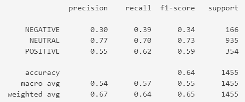

## 📝 Назначение модели
Модель предназначена для автоматической классификации постов из сообщества "Российские железные дороги (ОАО "РЖД")" ВКонтакте по тональности:
- **POSITIVE** — позитивные комментарии  
- **NEGATIVE** — негативные комментарии  
- **NEUTRAL** — нейтральные комментарии  

## 📊 Тип модели
- Logistic Regression
- Векторизация: TF-IDF
- Разметка через RuBERT

## 🧩 Входные данные
- Датасет с постами на русском языке

## 🏗 Архитектура
1. Парсинг постов из сообщества "Российские железные дороги (ОАО "РЖД")" социальной сети "ВКонтакте"
2. EDA (Разведочный анализ данных)
3. Предварительная обработка текстовых данных 
4. Разметка данных при помощи предобученной модели "blanchefort/rubert-base-cased-sentiment"
5. TF-IDF векторизация  
6. Классификация Logistic Regression  

## 📈 Метрики
На тестовом датасете (`preprocessed_ds.csv`):
